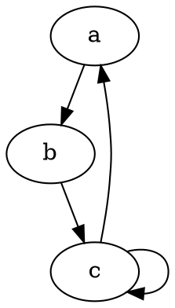
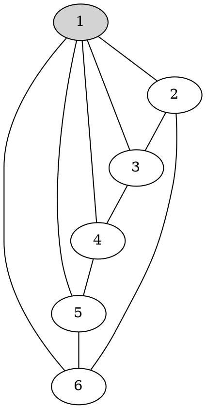

# 测试文档

[toc]


## 标题2

渲染插件：[Markdown Preview Enhanced](https://shd101wyy.github.io/markdown-preview-enhanced/#/zh-cn/)

### 标题3

#### 标题4

##### 标题5

###### 标题6

<del>niconiconi</del>

段落段落段落段

段落段落段落段落段落段落段

段落段落段落段落段落段落段落段落段落段落段落段落段落段落段落段

段落段落段落段落段落段落段落段落段落段落段落段落段落段落段落段段落段落段落段落段落段落段落段落段落段落段落段落段落段落段落段

1. 有序列表1
2. 有序列表2
3. 有序列表3

+ 无序列表
    + 无序列表
      + 无序列表
        + 无序列表


| 列1 | 列2 | 列3 |
| ----- | ----- | ----- |
| a     | b     | c     |
| 1     | 2     | 3     |


## 数学公式

行内公式：$e^{\pi i}+1=0$

行间公式

$$\sum_{k=1}^{\infty}{\frac{1}{k}}=1+\frac{1}{2}+\frac{1}{3}+\cdots = \infty$$

## 代码块

```c
printf("hello world");
```

```c++
cout<<"hello world"<<endl;
```

```rust
println!("hello world");
```

## 本地图片


## 嵌入 html

<center>

</center>

<center>
<del>12dora: cnm你不会百度吗</del>
</center>

## 嵌入 script

```javascript
// 按 F12 进入控制台查看
console.log("This is Sparta!!!!!")
```

<script>
console.log("This is Sparta!!!!!")
</script>

## 图形





流程图

```sequence {theme="simple"}
local->github: push master
Note over github: deploy gh-pages
github->gitee: sync repo
Note over gitee: deploy gitee pages
```